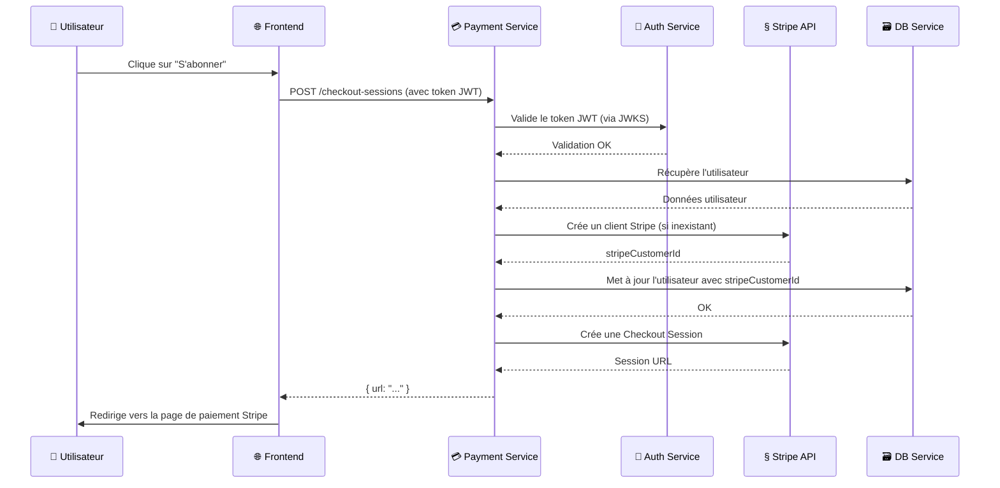
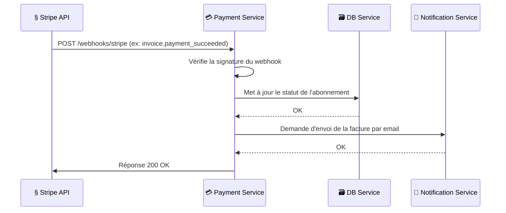

# 💳 SupervIA Payment Service - Gestion des Paiements et Abonnements

[](https://github.com/zkerkeb-class/payment-services-Tadayoshi123)
[](https://nodejs.org/)
[](./LICENSE)

> **Microservice dédié à la gestion des transactions financières, des abonnements et de la facturation via l'API Stripe.**

Ce service est la pierre angulaire de la monétisation de SupervIA. Il fournit une interface sécurisée et centralisée pour toutes les opérations de paiement, s'intégrant profondément avec Stripe pour offrir une expérience utilisateur fluide et fiable.

---

## 📋 Table des matières

1.  [**Fonctionnalités Clés**](#-fonctionnalités-clés)
2.  [**Architecture & Flux**](#-architecture--flux)
    -   [Flux de Création d'Abonnement](#flux-de-création-dabonnement)
    -   [Flux de Webhook](#flux-de-webhook)
3.  [**Installation et Lancement**](#-installation-et-lancement)
4.  [**Documentation de l'API**](#-documentation-de-lapi)
5.  [**Gestion des Webhooks Stripe**](#-gestion-des-webhooks-stripe)
6.  [**Sécurité**](#-sécurité)

---

## ✨ Fonctionnalités Clés

-   **Intégration Stripe Complète** : Utilise l'API Stripe pour gérer les clients, les abonnements et les paiements.
-   **Gestion des Abonnements** : Crée des sessions de paiement (`Checkout Sessions`) pour de nouveaux abonnements.
-   **Portail Client** : Fournit un accès au portail de facturation Stripe (`Billing Portal`) où les utilisateurs peuvent gérer leurs abonnements et moyens de paiement.
-   **Traitement des Webhooks** : Écoute les événements Stripe via un endpoint sécurisé pour synchroniser l'état des abonnements, des paiements et des factures.
-   **Communication Inter-Services** :
    -   Communique avec le **DB Service** pour lier les clients Stripe aux utilisateurs SupervIA et mettre à jour leur statut d'abonnement.
    -   Communique avec le **Notification Service** pour envoyer des emails transactionnels (ex: confirmation de paiement, facture).
-   **Sécurité Renforcée** : Valide les tokens JWT (RS256) des utilisateurs pour les actions initiées par le client et vérifie les signatures des webhooks pour les événements initiés par Stripe.

---

## 🏗️ Architecture & Flux

Le service de paiement s'intègre au cœur de l'écosystème, agissant comme un pont entre le frontend, les services de données et de notification, et l'API externe de Stripe.

### Flux de Création d'Abonnement



### Flux de Webhook



---

## 🚀 Installation et Lancement

### Prérequis
-   **Node.js** >= 18.x
-   **Docker** & **Docker Compose**
-   Un compte **Stripe** avec vos clés API (`pk_...`, `sk_...`).
-   Le **CLI Stripe** (recommandé pour tester les webhooks localement).

### Configuration (.env)
1.  Copiez le fichier d'exemple : `cp .env.example .env`
2.  Ouvrez `.env` et remplissez les variables :
    -   `STRIPE_API_KEY`, `STRIPE_PUBLISHABLE_KEY`, `STRIPE_WEBHOOK_SECRET`.
    -   `JWT_SECRET` : Le secret partagé pour la communication inter-services.
    -   `AUTH_SERVICE_URL` : L'URL du service d'authentification pour la validation des tokens utilisateur.
    -   Les URLs des autres services (`DB_SERVICE_URL`, `NOTIFICATION_SERVICE_URL`).

### Lancement avec Docker
```bash
# Depuis la racine du projet, avec le docker-compose global
docker-compose up -d supervia-payment-service

# Pour voir les logs
docker-compose logs -f supervia-payment-service
```

---

## 📖 Documentation de l'API

Une documentation Swagger complète est disponible sur le endpoint `/api-docs` lorsque le service est en cours d'exécution.

### Endpoints Principaux
Préfixe: `/api/v1/payments`

-   `POST /checkout-sessions`: **(Authentifié)** Crée une session de paiement Stripe pour initier un abonnement.
-   `POST /portal-sessions`: **(Authentifié)** Crée une session de portail client Stripe pour que l'utilisateur puisse gérer son abonnement.
-   `GET /subscription`: **(Authentifié)** Récupère l'abonnement actif de l'utilisateur connecté.

---

## 🎣 Gestion des Webhooks Stripe

Le service expose un endpoint public pour recevoir les événements de Stripe :
`POST /api/v1/webhooks/stripe`

**Implémentation Clé :** Cet endpoint utilise `express.raw({ type: 'application/json' })` pour recevoir le corps de la requête brut, ce qui est **indispensable** pour la vérification de la signature de sécurité de Stripe.

**Événements gérés :**
-   `checkout.session.completed`: La page de paiement a été complétée.
-   `invoice.payment_succeeded`: Un paiement de facture a réussi. Déclenche l'envoi de l'email de facture.
-   `invoice.payment_failed`: Un paiement a échoué.
-   `customer.subscription.created`, `updated`, `deleted`: Le statut de l'abonnement a changé. Met à jour la base de données SupervIA.

**Tester localement avec le CLI Stripe :**
```bash
# Installez le CLI, puis connectez-vous
stripe login

# Écoutez les événements et transférez-les à votre service local
stripe listen --forward-to localhost:3006/api/v1/webhooks/stripe
```
Cette commande vous fournira le `STRIPE_WEBHOOK_SECRET` à mettre dans votre `.env` pour le développement.

---

## 🔐 Sécurité

-   **Authentification Utilisateur (JWT RS256)**: Pour les routes initiées par le client, le service utilise un middleware `express-jwt` avec `jwks-rsa` pour valider les tokens JWT émis par l'Auth Service. Il récupère les clés publiques depuis le endpoint `.well-known/jwks.json` de l'Auth Service.
-   **Authentification Service-à-Service (JWT HS256)**: Pour les appels sortants vers le DB Service ou le Notification Service, il génère un token JWT à courte durée de vie signé avec un secret partagé (`JWT_SECRET`).
-   **Vérification des Webhooks**: L'intégrité des événements entrants de Stripe est garantie par la vérification de la signature HMAC-SHA256 dans l'en-tête `stripe-signature`.
-   **Middlewares de Sécurité Standards**: Utilise `helmet`, `cors`, et `express-rate-limit` pour une protection de base. 